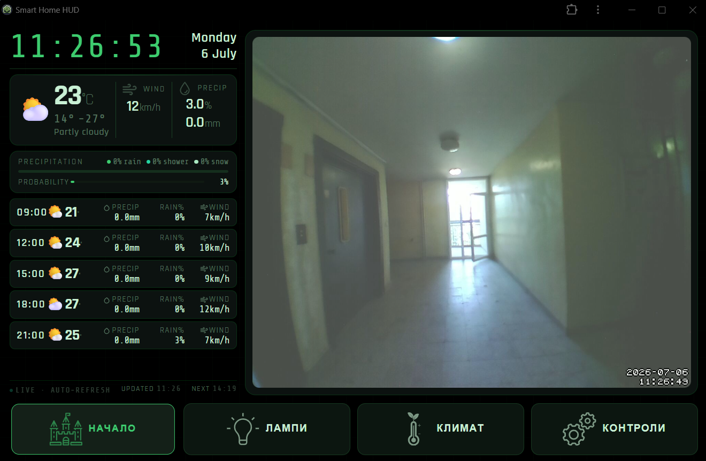

# Home Automation Server
I wanted a custom alternative to something like Home Assistant, without the bloat and working the way I want it to.
Designed to run on a cheap Raspberry Pi, but currently running in a docker container on TrueNAS

## Features
* Real-time device control and telemetry via STOMP over WebSocket (with SockJS fallback)
* PostgreSQL database with version control, using Flyway
* Web UI

## Current capabilities
* Converts the regular lights to smart lights
* [Smart door lock](https://github.com/niki-stadnik/smart-doorlock), with [RFID control](https://github.com/niki-stadnik/smart-doorman) of the front door
* Controls the operation of the bathroom fan, measuring temperature and humidity
* Manages the video freed from the smart doorbell
* Measures humidity and temperature in herb pot and managing grow light operation, with the plans to enable automatic watering
* Controls the operation of led strips
* room temperature control by connecting to the api of other devices, for an all-in-one UI

## In Progress capabilities
* curtains automation

